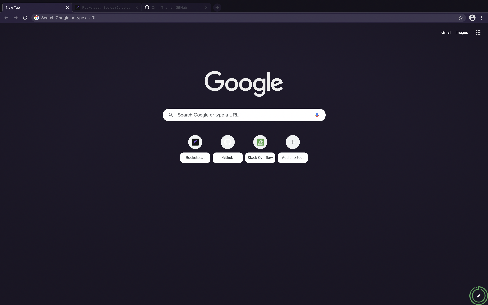

# Omni for [Google Chrome](https://www.google.com/intl/pt-BR/chrome/)

> A dark theme for [Google Chrome](https://www.google.com/intl/pt-BR/chrome/).



## [Install](./INSTALL.md)

#### Download using Git

If you are a git user, you can install the theme and keep up to date by cloning the repo:<br>

```
// Using https
git clone https://github.com/birobirobiro/google-chrome-omni.git

// Using ssh
git clone git@github.com:Rocketseat/google-chrome-omni.git
```

#### Download manually

Download the theme by using the [GitHub .zip download](https://github.com/birobirobiro/google-chrome-omni/archive/master.zip) option. After downloading it you must unzip the file and you'll have the theme folder.

### Activating theme

- Type `chrome://extensions/` in the adress bar.
- Select the `Developer Mode` checkbox.
- Click the `Load unpacked` button.
- Choose `google-chrome-omni`

## Team

This theme is maintained by Rocketseat

[](https://github.com/birobirobiro) |
--- |
[João Inácio](https://github.com/birobirobiro) |

## License

[MIT License](./LICENSE)